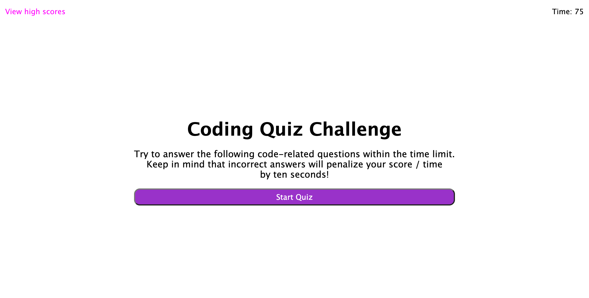
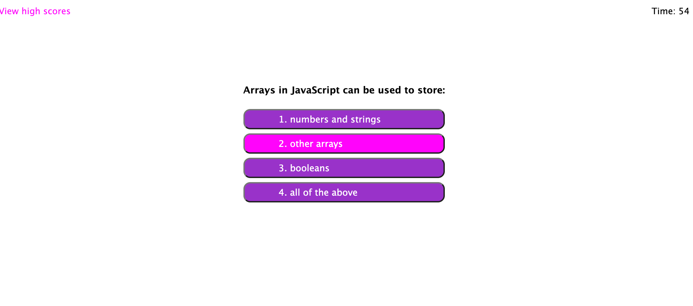
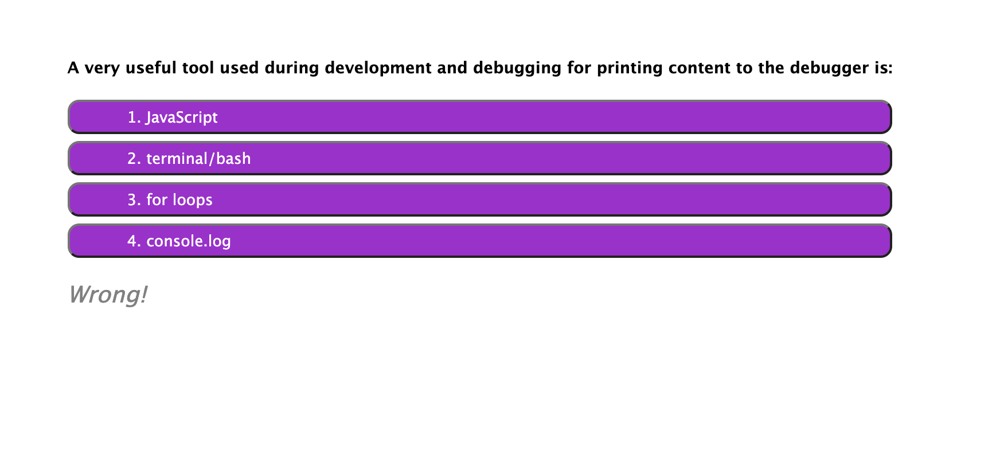

# Coding Quiz

## Purpose
A multiple choice timed quiz to test a student on the basics of JavaScript.  Students can compete for a high score by getting getting as
many correct answers as they can in 75 seconds.  Each wrong answer decrements the time by 10 seconds.

## Built With
* HTML
* CSS
* JavaScript

## Website
https://jonprine.github.io/coding-quiz/

## Contribution
Made by Jon Prine
Reference: Web Dev Simplified on YouTube

## Screenshots of Finished Page

